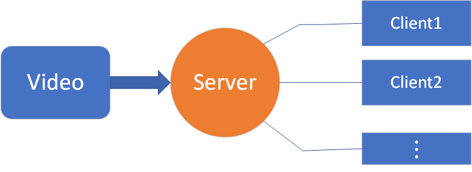
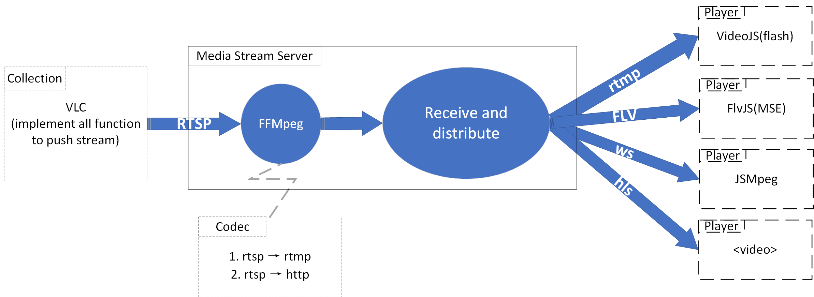

# 
Live Video Streaming Designment</cneter>
## 1. Introduction
### 1.1 Backgroud
Studying the technology of live video streaming could be used in context of mini project.
### 1.2 Document description
Study the technical solutions of live video streaming.

## 2. Requirement analysis
Users can watch videos on Web pages and control the video play and pause. Video delay time is not considered for the moment.
The main purpose is to learn the workflow and related technology of live video streaming. It's better to have a demo.

## 3. Functional module
### 3.1 Structure diagram

### 3.2 Video module
This part provide video by camera or video software.

### 3.3 Server
The main function of this part is to encode and decode, convert the video stream format and protocol, receive and distribute the video stream.

### 3.4 Client
H5 web page can play the video in real time.

## 4. Outline design

### 4.1 Collection
The main function of this part is to push video streaming, that is to say, provide video streaming. To build a test environment faster, use 'VLC' to implement. Use VLC to directly generate video stream for streaming media server.

**Notes：** The vlc can only produce 'rtsp'.

### 4.2 Streaming media server
Streaming media server includes two parts, namely FFmpeg and distribution.

#### 4.2.1 FFmpeg
FFmpeg is a complete, cross-platform solution to record, convert and stream audio and video. We can use ffmpeg cli to implement the conversion of video format and streaming protocol. For protocol, it depends on the front end. For example, convert rtsp to rtmp or http.
FFmpeg also provides source code, you can also implement the conversion function by yourself.

#### 4.2.2 Distribution
It can be implemented using existing servers, such as SRS, BMS nginx(free) and so on. In addition, you can also build your own server to implement. Here are tow solutions:
* nginx
    1. Add nginx-rtmp-module on nginx
    2. According protocol to configure 'nginx.conf'
    3. run nginx

* Websocket：Use websocket to build own server. It can use multiple languages to implement webSocket server. Here is implemented in NodeJS(WebSocket-Node).  
    1. Install nodeJS
    2. Install WebSocket-Node
    3. Write logic code
    4. Run WebSocket

#### 4.3 Player
Since HTML5 only supports HLS and DASH, pay attention to the use of streaming protocols and players.
* RTMP &rarr; `<video>`(Flash--[VideoJS](https://videojs.com/))  &rarr; Most browsers disable flash
* Http-Flv &rarr; `<video>`([FlvJS](https://github.com/Bilibili/flv.js) and [MSE](https://w3c.github.io/media-source/))
* WS &rarr; `<canvas>`([JSMpeg](https://github.com/phoboslab/jsmpeg))
* HLS &rarr; `<video>`  &rarr; The delay is more serious

**********************************************
## WebRTC
**By understanding some relevant knowledage of webRTC, I think webRTC is a huge subject. So, I feel it can be implemented step by step in the future. Here is a brief introduction to it.**

### Introduction
The browsers themselves don't support direct channel communication between each other, and all need to be relayed through the server. Therefore, a message between two clients needs to pass through two channels, and the channel efficiency is limited by the bandwidth of the two channels. So how to establish point-to-point transmission between browsers, WebRTC came into being.

WebRTC(Web Real-Time Communication Technology) is a collective name for a series of specifications, standards, and APIs for establishing low-latency Peer-to-Peer real-time communication, or more like a solution. The browsers currently supported by this technology are Chrome, firefox, Opera, Edge. In addition, some native apps(Safari, Chrome) of ios and Andriod also support WebRTC. **Based on UDP, it supports cross-platform(windows, linux, mac, andriod).**

### Limit
* Audio dose not support ACC encoding, 44.1k sampling rate
* Video does not support: B frame, H256, multi-slice encoding
* WebRTC connection process takes too long, which will affect the second opening experience

### Main JavaScript API
* getUserMedia
* MediaRecorder

* RTCPeerConnection
    * Signal processing
    * Codec handling
    * Peer to peer communication
    * Security
    * Bandwidth management
    * ...
* RTCDataChannel 
    * Same API as WebSockets
    * Ultra-low latency
    * Unreliable or reliable
    * Secure